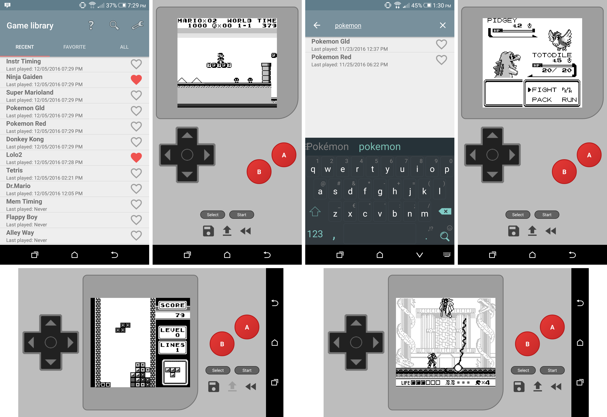

# GameDroid
---

A GameBoy emulator for Android. This is the term project for COMP 3004 at Carleton University.

Repository structure:
* `dev_logs/` contains weekly development logs for each team member
* `docs/` contains documents related to the project. This contains a few documents which were handed in for COMP 3004, but it is mostly documentation of GameBoy hardware to refer to while implementing the emulator. Unless otherwise stated, this material is by other authors and is used purely as reference material
* `GameDroid/` contains the application's source code

Major features:
* Accurate GameBoy emulation (passes cpu_instrs, instr_timing, and lcd_sync test ROMs)
* Easy to use UI for organizing and searching game library
* SRAM saves
* Save states
* Rewind
* Customizable screen resolution

Supported MBCs:
* MBC1
* MBC2
* MBC3 (no RTC)
* MBC5 (no rumble)

Promo video:
https://www.youtube.com/watch?v=SpdBk_0kcU4

Screenshots:

Minimum Android version: 4.0.3 (Ice Cream Sandwich)
